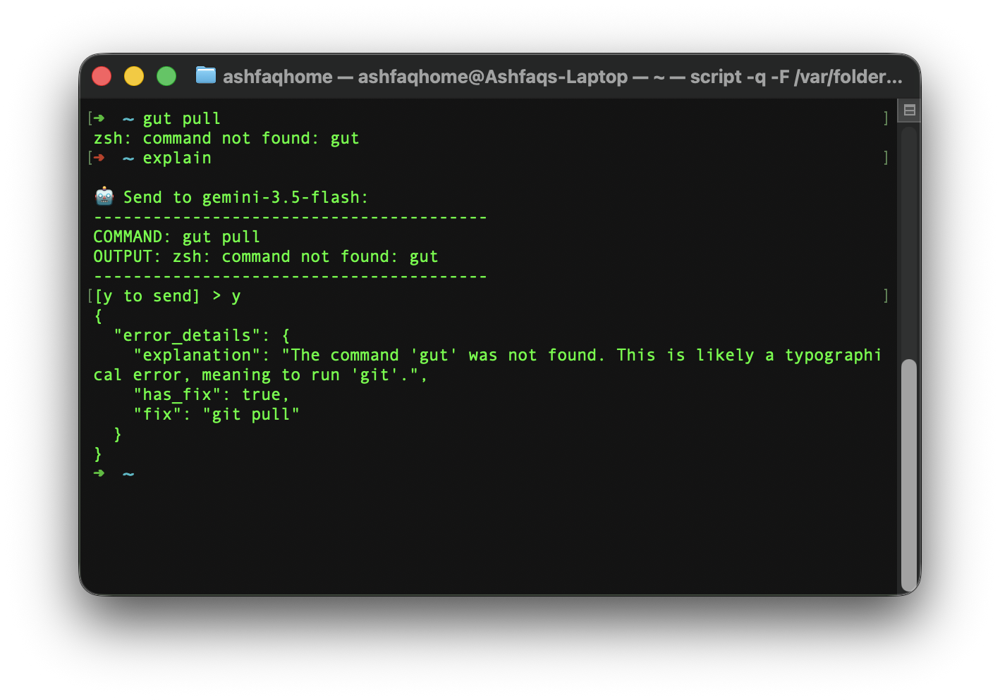

# Add the below script to your shell's rc file( for zsh , it is ~/.zshrc) :

```if [[ -o interactive && -z "$EXPLAIN_LOG" ]]; then
  export EXPLAIN_LOG="${TMPDIR:-/tmp}/explain_$$.log"
  export EXPLAIN_MARKS="${TMPDIR:-/tmp}/explain_$$.marks"
  exec script -q -F "$EXPLAIN_LOG" "$SHELL"
fi

preexec() {
  [[ "$1" == explain* ]] && return    # don't record the explain call itself
  typeset -g _EXPLAIN_LAST_CMD="$1"
  printf 'START\t%s\t%s\n' \
    "$(wc -l < "$EXPLAIN_LOG" 2>/dev/null | tr -d ' ')" "$1" \
    >> "$EXPLAIN_MARKS"
}

precmd() {
  [[ -z "${_EXPLAIN_LAST_CMD:-}" ]] && return
  printf 'END\t%s\n' \
    "$(wc -l < "$EXPLAIN_LOG" 2>/dev/null | tr -d ' ')" \
    >> "$EXPLAIN_MARKS"
  typeset -g _EXPLAIN_LAST_CMD=""
}

zshexit() { rm -f "$EXPLAIN_LOG" "$EXPLAIN_MARKS" 2>/dev/null; }

<!-- replace the python path  -->
explain() { /Users/ashfaqhome/.local/scripts/.venv/bin/python3 ./cli-your-script.py "$@"; }
```
# Screenshot:

